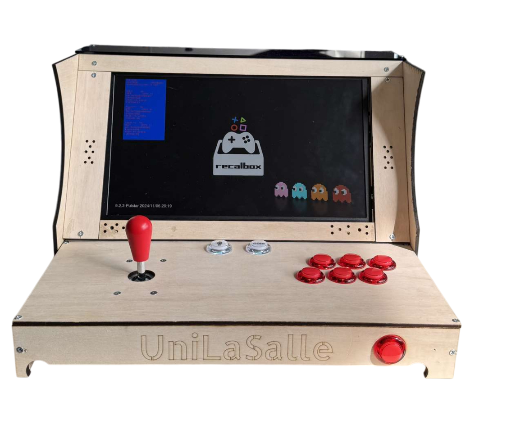

#  Projet de borne arcade

Bienvenue sur la documentation de notre projet de borne arcade.

## Objectifs du projet

- Concevoir une borne d'arcade fonctionnelle
- Réaliser l'assemblage du matériel
- Installer et configurer les logiciels nécessaires
- Documenter chaque étape de réalisation

Retrouvez toutes les étapes, choix techniques, photos et détails du projet dans les sections de gauche.

## Poster

## Vidéo

<video width="720" height="480" controls>
  <source src="https://dl.dropboxusercontent.com/scl/fi/bb3567ev14kaqg8rg9qp4/video.mp4?rlkey=lgvcdwlqa8ywrm3grd2c7aykf&st=drn8kqi4" type="video/mp4">
  Votre navigateur ne supporte pas la lecture vidéo.
</video>

---
